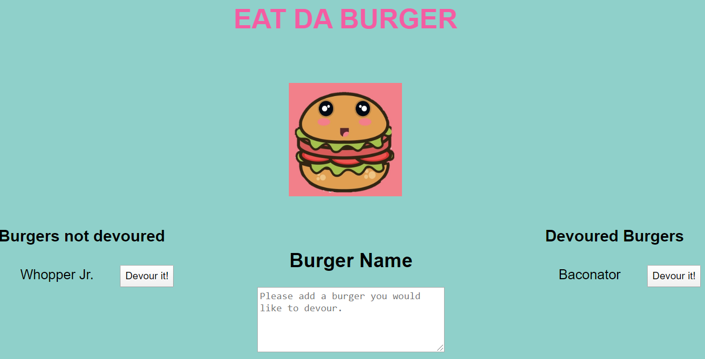

# Happy Burger

## INTRODUCTION

As a burger enthusiast I want an app to simulate devouring burgers so that can enjoy devouring them without the calories.

 

## TABLE OF CONTENTS

2. [FEATURES](#features)
3. [INSTALLATION](#installation)
4. [PREVIEW](#preview)
5. [RESOURCES](#resources)
6. [BADGES](#badges)

 

## FEATURES

A burger app that allows users to input a burger they would like to devour. Once user clicks the submit button, the burger is then put into "Burgers Not Devoured" column with a "Devour It" button. When user clicks the button, the burger is then moved to the devoured column.  All of the users' choices are stored in a mySQL database.

 

## INSTALLATION

To use the application, install (npm install) the following dependencies:

* express: node framework

* express-handlebars: 

* mysql: allows access to mySQL database

 

## RESOURCES

**Bootstrap 4:** grid setup

**VectorStock:** Burger clipart
 

### PREVIEW

 

### BADGES

Please click the badge below to be routed directly to the app.

